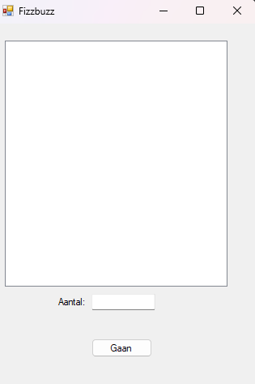

# ***Fizzbuzz***

#
<h2>Omschrijving</h2>

<p1>Dit is een Fizzbuzz gemaakt met C#.</p1>  
  <p2>Als de getal deelbaar is door 3 krijg je Fizz te zien.
  Als de getal deelbaar is door 5 krijg je Buzz te zien.
  Als de getal deelbaar is door 5 en 3 krijg je FizzBuzz te zien.</p2>
